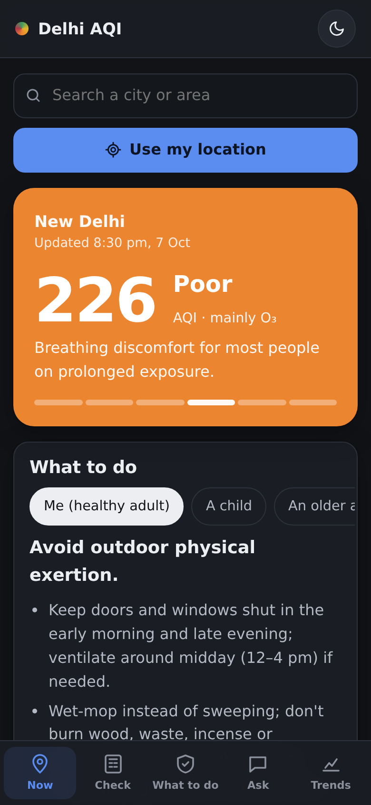
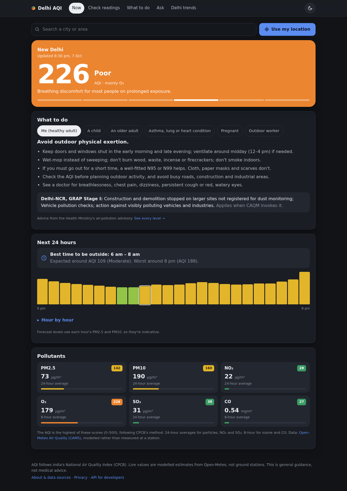
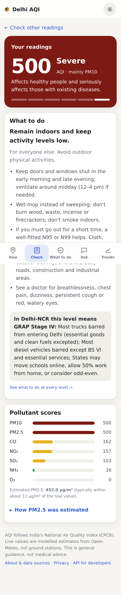
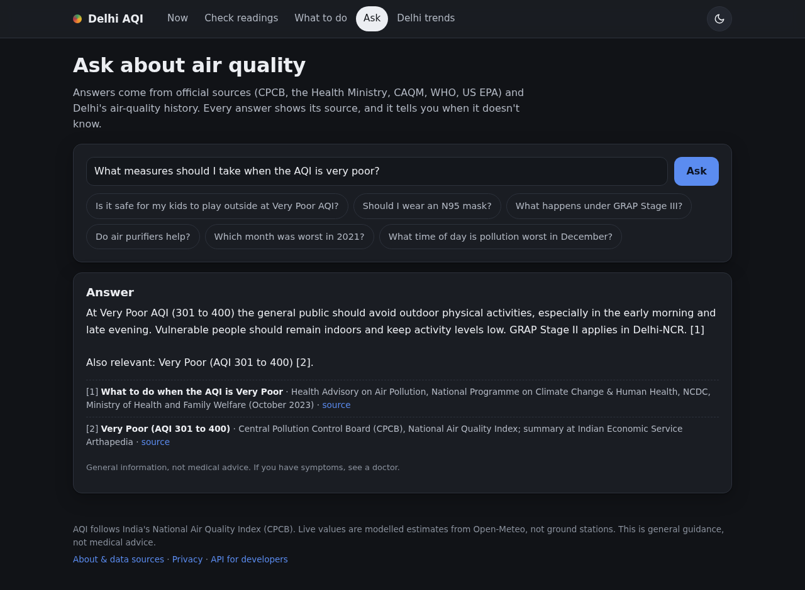

# Delhi AQI – PM2.5 estimation, India's AQI and a grounded air-quality assistant

A Django web app and REST API that estimates PM2.5 for an hour in Delhi from the other pollutants measured in that hour, converts it to **India's National Air Quality Index (CPCB NAQI)**, explains which pollutants drove the result, and answers questions about air quality from **official sources with citations** (RAG).

Built as my internship project, then rebuilt to fix the AQI scale, evaluate properly, and serve it as a real web application.

| Phone | Desktop |
|---|---|
|  |  |
|  |  |

## What it does

A mobile-first web app (installable to the home screen) with five tabs:

| Tab | What you get |
|---|---|
| **Now** (`/`) | Live AQI for central Delhi, **your location** (browser permission) or **any city** (search). Calculated the CPCB way: 24-hour averages for particles, NO₂ and SO₂, 8-hour for ozone and CO. Shows the category, what it means, **what to do** for the person you choose (you, a child, an older adult, asthma/heart condition, pregnant, outdoor worker), GRAP rules when you're in Delhi-NCR, a **24-hour outlook with the best time to go outside**, and every pollutant's score. Your last place and choice are remembered. |
| **Check** (`/check/`) | Enter your own readings without PM2.5; the ML model estimates PM2.5, then the app gives the AQI and advice. "How PM2.5 was estimated" shows which readings pushed the estimate up or down. |
| **What to do** (`/what-to-do/`) | Every AQI level: Health Ministry advice for everyone and for vulnerable groups, and the GRAP stage rules for Delhi-NCR. |
| **Ask** (`/ask/`) | Questions answered from official sources (CPCB, MoHFW, CAQM, WHO, US EPA) and Delhi's history, with citations; it says when it doesn't know. |
| **Trends** (`/trends/`) | Delhi 2020–2023: monthly, seasonal and hour-of-day patterns, worst days, Diwali. |

Behind the scenes: **About** (`/about/`) explains the data and privacy; **How the model works** (`/about/model/`) has the evaluation; the **REST API** has Swagger docs at `/api/docs/`; stored estimates are visible to staff only (`/staff/history/` and the Django admin). Dark and light themes, a phone tab bar, 404/500 pages and a web-app manifest are included.

## Results (test set = the most recent 3,756 hours, Aug 2022 – Jan 2023, never seen in training)

| Model | MAE (µg/m³) | R² | Category accuracy | Macro F1 | Size |
|---|---:|---:|---:|---:|---:|
| PM10 ratio (baseline) | 16.25 | 0.990 | 88.8% | 0.82 | – |
| Linear regression | 17.55 | 0.989 | 86.1% | 0.77 | – |
| Random forest | 10.71 | 0.995 | 93.2% | 0.89 | 19.6 MB |
| **Gradient boosting (chosen)** | **11.01** | **0.994** | **93.0%** | **0.89** | **0.4 MB** |

- **Split by time, not randomly.** Train on the first 80% of the timeline, test on the last 20%. A random split lets the model see the hours either side of each test hour, which flatters it.
- **A baseline first.** "PM2.5 is a fixed share of PM10" already gets an MAE of 16.25. Linear regression doesn't beat it; the tree models cut the error by about a third.
- **Model choice.** Random forest is 0.3 µg/m³ more accurate but 50× larger. The rule is: lowest MAE, but prefer a smaller model within 5% of it, because the app has to load on a free hosting tier.
- **Ablation.** Without PM10 the error rises to 36.4 µg/m³ (R² 0.945). PM10 is the key input, but the other gases carry real signal.
- Almost all category mistakes are one band off (99.9–100% within one category).

## Corrections made to the original project

1. **AQI scale.** The original labelled raw PM2.5 concentrations with US AQI cut-offs (Good ≤ 50 …), which mixes up concentration with the index. This version uses India's CPCB NAQI breakpoints for all pollutants, takes the worst sub-index as the AQI, and reports the prominent pollutant.
2. **PM2.5 was predicted with linear regression**, the weakest model, while the category came from separate classifiers, so the number and the label could disagree. Now the category is derived from the predicted PM2.5.
3. **No evaluation was reported.** Now there's a time-based test set, a baseline, an ablation and a confusion matrix, all regenerated by `python manage.py train_models`.
4. **Timestamps were UTC.** Ozone (which forms in sunlight) peaked at 08:00–09:00 in the raw file and PM2.5 bottomed at 09:00: that's 13:30–14:30 IST. The data is shifted to IST so seasonal and hourly patterns are correct.
5. The 34 MB model file, unrealistic default inputs (all 1.0) and a README that didn't match the code are gone.
6. Robustness: a missing database table no longer crashes the page (the estimate still shows, with instructions to run `migrate`), and a model saved with another scikit-learn version is refitted automatically.

## Architecture

```
core/                 framework-independent logic (unit-tested on its own)
  naqi.py             CPCB breakpoints, sub-indices, overall AQI, GRAP stage
  ml.py               training, time-split evaluation, model choice, prediction, explanations
  stats.py            dashboard aggregates + data tools for the assistant
  rag.py              knowledge-base chunking, TF-IDF retrieval, threshold, evaluation
  llm.py              client for any OpenAI-compatible API (Groq, OpenAI, Ollama…)
  assistant.py        tool-calling agent, grounding guard, offline fallback, result explanations
  live.py             Open-Meteo live readings with cache and fallback
predictor/            the Django app
  models.py           Prediction (ORM)        views.py / templates/   web pages
  api.py              DRF API views            serializers.py          validation
  management/commands train_models, eval_rag
knowledge/            source notes (CPCB, CAQM GRAP, WHO, MoHFW) with URLs
eval/                 retrieval evaluation questions
artifacts/            trained model + metrics.json
```

Request flow for an estimate: form/serializer validation → `services.run_prediction` → `ml.Predictor` (loaded once per process) → `naqi.overall_aqi` → saved as a `Prediction` → explanation (LLM if configured, else template) → page or JSON.

## How the assistant works (RAG + tools)

- **Knowledge base:** short notes in `knowledge/`, each summarising one official source with its URL: CPCB NAQI categories and breakpoints, CAQM's GRAP stages, WHO 2021 guidelines, the Health Ministry advisory and its AQI-level actions, the US EPA guide to home air cleaners, plus notes on this dataset and app.
- **Chunking:** one chunk per section (46 chunks). Each section answers one question, so chunks stay focused and every answer can cite a specific section.
- **Retrieval:** TF-IDF (unigrams + bigrams, light stemming, a small synonym map such as kids → children) with cosine similarity, top 3. TF-IDF is enough for 38 chunks, needs no model download and fits free hosting; set `RAG_BACKEND=embeddings` to use `all-MiniLM-L6-v2` instead.
- **Refusal:** if no chunk scores above the threshold (0.14), the assistant says it doesn't know instead of guessing.
- **Topic gate + threshold:** a question must mention at least one air-quality or health word, and the best chunk must score above the threshold, or the assistant says it doesn't know. The evaluation set found why both are needed: "a good movie to **watch**" matched "symptoms to **watch**" and "**Good** AQI".
- **Evaluation** (`python manage.py eval_rag`): on 31 answerable questions the right section is in the top 3 for **93.5%**; all **6 of 6** out-of-scope questions are refused. The threshold was chosen on this same small set with `--sweep`, so a larger held-out set would be the next step.
- **Tool calling:** with an LLM configured, the model chooses between `search_guidelines` and four data tools (`monthly_average`, `worst_days`, `hourly_profile`, `year_summary`) and writes the answer from their results.
- **Grounding guard:** the ML model and the data tools produce every number; the LLM only writes the words. The app checks that every number in an LLM answer appears in the evidence it was given, and that an explanation names the predicted category. If an explanation fails, the standard template is shown; if an answer fails, it carries a warning.
- **Works without a key:** with no `LLM_API_KEY`, guidance questions return the best-matching source passage with its citation, and data questions are routed to the tools by simple rules.

## REST API

Interactive docs: `/api/docs/` (Swagger). Throttled at 60 requests/min per client, 10/min for the assistant.

```bash
curl -X POST http://127.0.0.1:8000/api/v1/predict -H "Content-Type: application/json" \
  -d '{"co": 2483, "no": 11.4, "no2": 50.7, "o3": 0.9, "so2": 31.5, "pm10": 409, "nh3": 11.7, "explain": true, "profile": "children"}'

curl "http://127.0.0.1:8000/api/v1/stats?year=2021&month=11"
curl  http://127.0.0.1:8000/api/v1/live
curl -X POST http://127.0.0.1:8000/api/v1/live -H "Content-Type: application/json" -d '{"lat": 19.076, "lon": 72.8777}'
curl  http://127.0.0.1:8000/api/v1/report                       # live AQI report, central Delhi
curl -X POST http://127.0.0.1:8000/api/v1/report -H "Content-Type: application/json" -d '{"lat": 19.08, "lon": 72.88, "label": "Mumbai"}'
curl "http://127.0.0.1:8000/api/v1/places?q=Pune"
curl "http://127.0.0.1:8000/api/v1/measures?aqi=320&profile=children"
curl -X POST http://127.0.0.1:8000/api/v1/ask -H "Content-Type: application/json" -d '{"question": "What happens under GRAP Stage III?"}'
```

## Run it locally (Windows PowerShell)

```powershell
python -m venv .venv
.venv\Scripts\Activate.ps1
pip install -r requirements.txt
python manage.py migrate         # creates the database tables (needed once)
python manage.py test            # 73 tests: pages, API and the core logic
python manage.py runserver       # open http://127.0.0.1:8000
```

With Anaconda you can skip the two `.venv` lines and run the rest in the Anaconda environment.
"Use my current location" works on `localhost`/`127.0.0.1` and on https sites, because browsers only share location there.

macOS/Linux: use `source .venv/bin/activate`. Optional: `python manage.py createsuperuser` and open `/admin/`.

**LLM (optional):** copy `.env.example` to `.env` and set `LLM_API_KEY` (Groq has a free tier). Without it everything still works in offline mode. The key is read on the server only.

**Retrain:** `python manage.py train_models`. The model is pickled separately from its metadata (`model_meta.json`). If the pickle was made with a different scikit-learn version, or gives different predictions than when it was trained, the app refits just the chosen model on start-up (a few seconds) instead of crashing.

## Deploy

Works on Render or PythonAnywhere (free tiers). On Render: build command `pip install -r requirements.txt && python manage.py collectstatic --noinput && python manage.py migrate`, start command `gunicorn aqi_site.wsgi`, and set `DEBUG=0`, `SECRET_KEY`, `ALLOWED_HOSTS` (and optionally `LLM_API_KEY`) as environment variables.

## Limitations

- The official AQI uses 24-hour averages (8-hour for CO and ozone); this app uses single hourly readings, so its AQI is indicative.
- It estimates PM2.5 for the same hour from other pollutants; it is **not a forecast**.
- The dataset (hourly, 25 Nov 2020 – 24 Jan 2023) has the same columns as OpenWeather's Air Pollution API, which publishes modelled estimates rather than CPCB station measurements. That probably explains the very tight PM2.5–PM10 relationship and some extreme values.
- The test period is mostly autumn and winter (42% of test hours are Severe), so accuracy in cleaner months is less certain.
- Live readings are modelled (Open-Meteo/CAMS), not measured at CPCB stations, so they can differ from official station AQI. Ammonia is only published for Europe, so elsewhere it is left out of the AQI rather than guessed. The 24-hour outlook uses each hour's PM2.5 and PM10 only, so it is indicative.
- Ozone and CO bands are defined for 8-hour averages. A single afternoon hour of ozone can push the indicative AQI far above the official 8-hour value; the result page warns when ozone or CO drives the AQI.
- Outside Delhi-NCR the model is extrapolating; the location feature tells you how far you are from Delhi.
- GRAP rules are revised from time to time; check [CAQM](https://caqm.nic.in/) for the schedule in force. Nothing here is medical advice.

## Sources

[CPCB National Air Quality Index](https://ies.gov.in/arthapedia/concept/national-air-quality-index) · [CAQM (GRAP)](https://caqm.nic.in/) · [WHO Global Air Quality Guidelines 2021](https://www.who.int/publications/i/item/9789240034228) · [MoHFW advisory on air pollution and health](https://ncdc.mohfw.gov.in/wp-content/uploads/2024/05/1-ADVISORY-ON-AIR-POLLUTION-AND-HEALTH.pdf) · [Open-Meteo Air Quality API](https://open-meteo.com/en/docs/air-quality-api)
